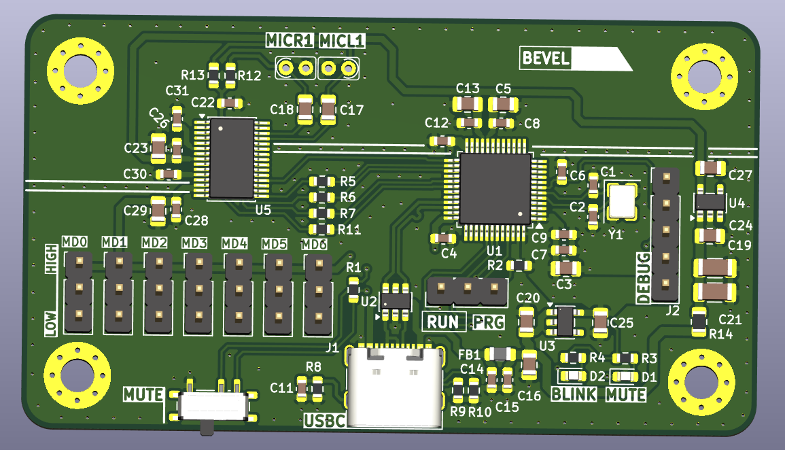
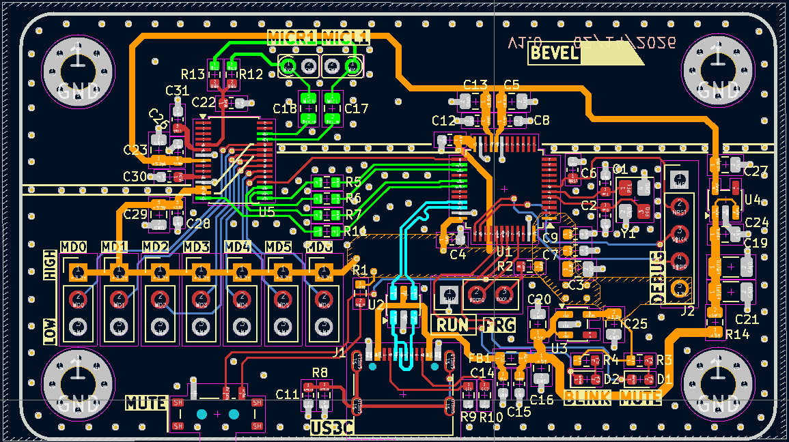
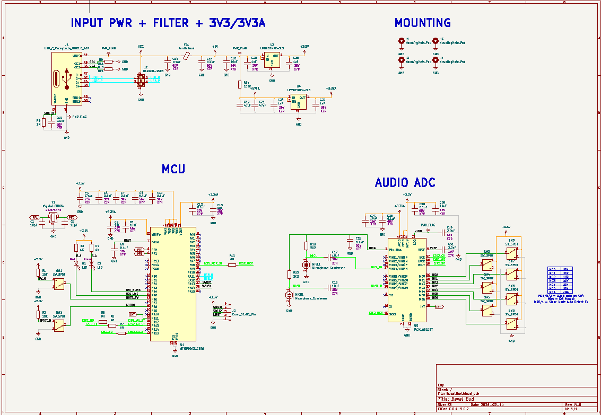

# Bezel_Bud
Take a webcam -> remove the camera -> improve the microphone.

- **Status:** Prototype Dev Board
- **Author:** Jack Kay

## Features

- **Feature 1:** 48KHz Dual Microphone - TI PCM1861
- **Feature 2:** Low noise components
- **Feature 3:** Power filtering
- **Feature 4:** 24.576MHz Crystal
- **Feature 5:** Mute switch and Visual LED
- **Feature 6:** Configurable jumpers for ADC
- **Feature 7:** USB-C for connectivity
- **Feature 8:** STM32G431CBT6

## Photos

### Assembly PCB

### Layout

### Schematic

## Firmware / Electronics

[WIP]

## CAD / Mechanical

[WIP]

## Build Instructions

[WIP]

## Usage

[WIP]

## License

This project is licensed under the terms in the `LICENSE` file.

## Contact

Maintainer: Jack Kay — jack.wil.kay@gmail.com
